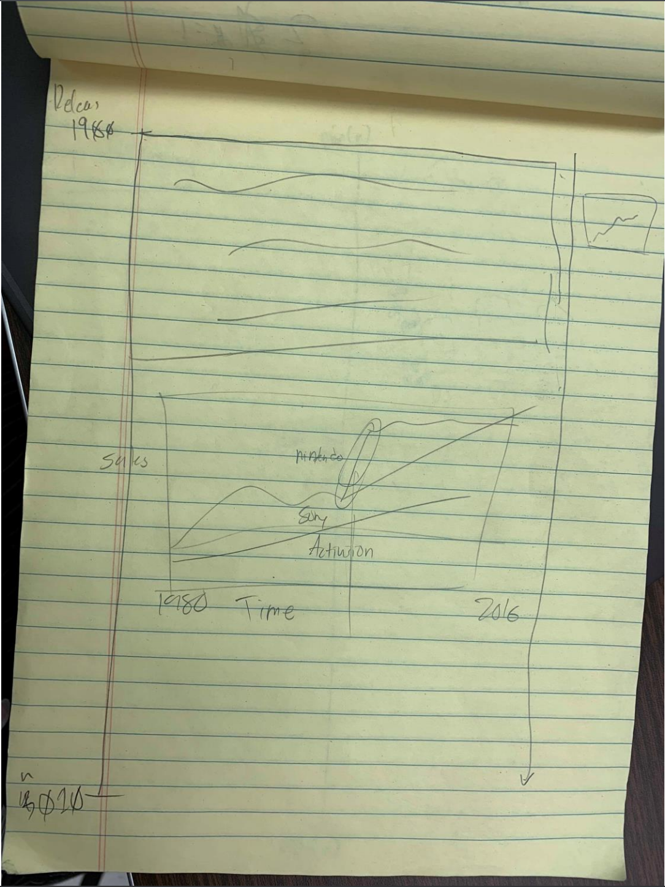
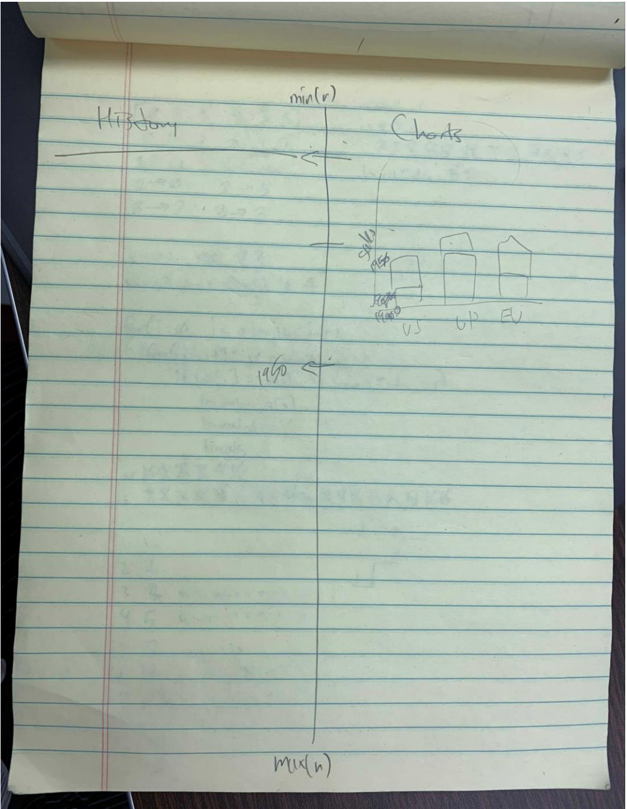
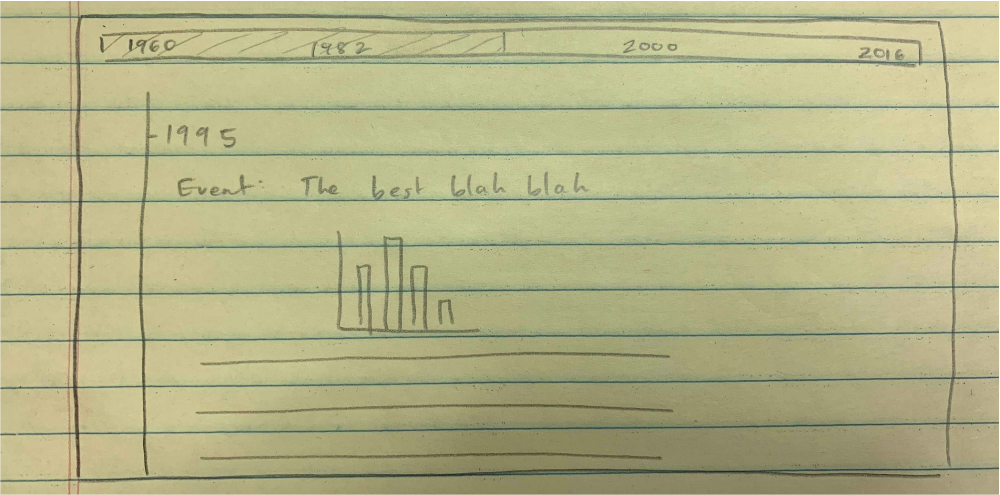
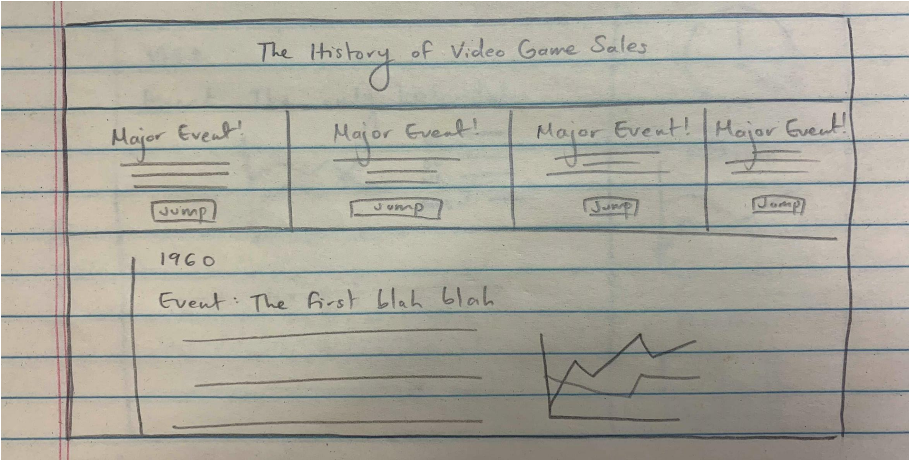
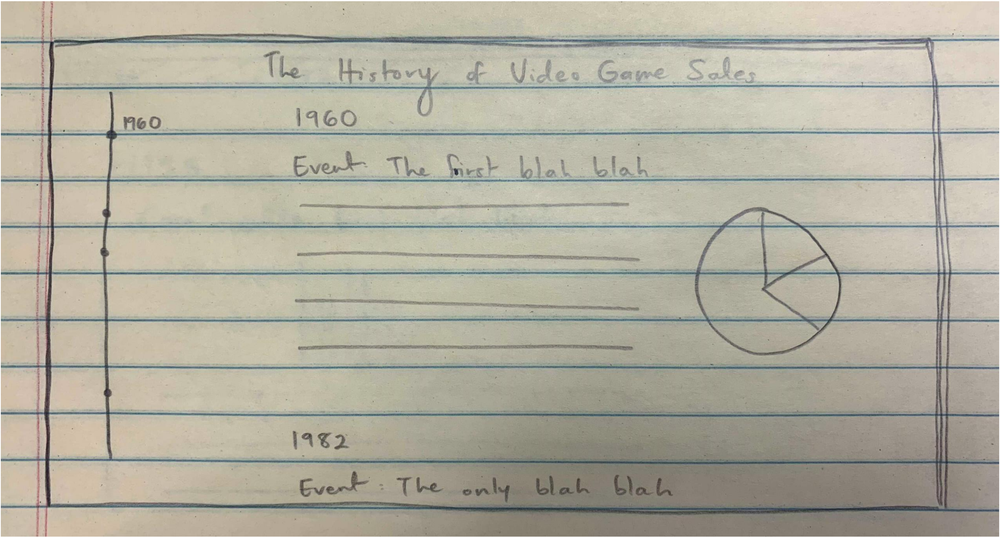
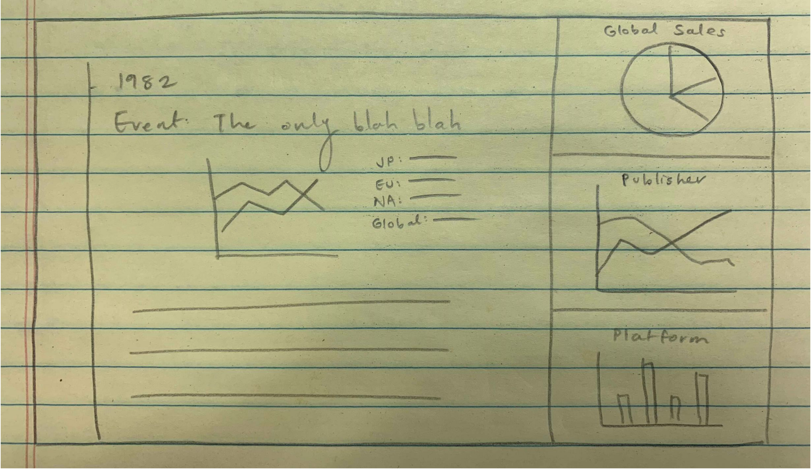
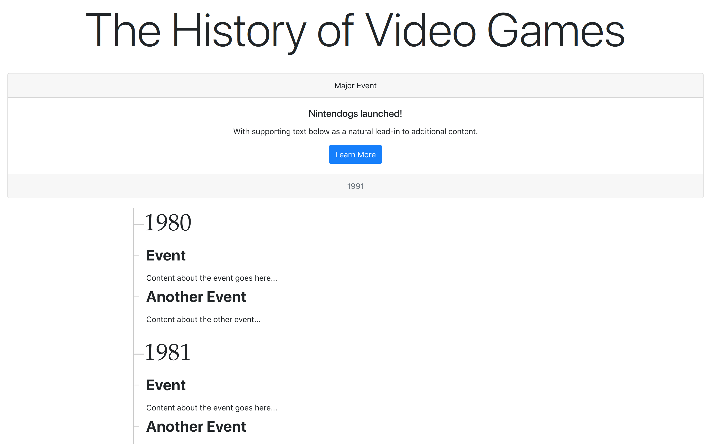
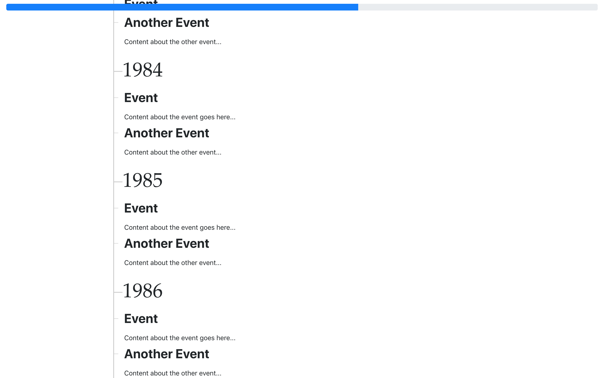

# Introduction

The main goal of our visualization is to tell the history of video games.

The dataset capitalizes on the sales of video games between 1980 and 2016. The additional layer of region-separated sales can explain how these same stories differ by culture. 
In the same way that your Amazon purchase history can explain if you're a serial killer, the sale history of video games can tell the tales of a publisher, platform, 
or genre's success... or failure. For example, the dataset claims the 15 top-selling games of this time period were published by Nintendo. 
But only by stepping through each release year can we see what led Nintendo to claim these spots. 

This is why we've decided to display our dashboard as a timeline, which will allow users to "step through" the data and follow the stories within video game history.

Each person accessing the visualizations will have different conclusions they want to draw from the sale history. Even amongst ourselves, we have different interests.
As indivual members, we discussed what sort of questions we are most insterested in answering:

Sae: 
For each release year, which genre/publisher/platform is leading in sales?

Kian:
Which platform / publisher is most successful?
Furthermore, which games led to that success?

Mariah:
What genre is most popular by region?
How was this affected by a region's culture and history?

#The Dataset

##Goals

Our goal is to provide them enough content (history and charts) within the timeline to find their own conclusions without hassle. At the very least, we will have sections of the timeline
which can answer the questions we posed above.
Attributes in the data set include game name, publisher name, release year for the game, game genre, rank of the video game based on number of copies sold, and number of copies sold globally and number of copies sold based on region (NA, EU, JP, and Other).
Based on this info we were thinking of building graphs which show things such as "In which year/time periods were certain genres, publishers, or platforms popular or successful?" and "Which countries contributed the most to video game sales and in which time periods?"
Using these graphs, we hope to tell the story about things like how certain genres rose and fell in popularity and in which countries, and about which publishers had success on which platforms and in what eras, and thorugh which specific games. We also intend to show outliars such as which games sold the most copies and which platforms or genres sold the most copies.

##Example Graphs

# Mock-Up Sketches

## Sketch 1:

A very simple outline of what the timeline might look like with the years on the left side of the screen.
On the far right hand of the screen we have mini-graphs that aren't as significant but may be useful to know.

## Sketch 2

A variation of the first outline where instead of the years being in the left side, it's in the middle.
The left side of the screen shows the history at that year and the charts shown on the right side of the
timeline.

## Sketch 3

Going back to the first sketch, with the timeline on the left, however the middle/right majority is represented with
the event information and graphs pertaining to that year. Also, the addition of a progressbar with the years
embedded into it so that use can track how far into the timeline they are in.

## Sketch 4

This sketch consists of the timeline without the progress bar, but giving the user the option to jump to a major event.
In the case where the user would like to not scroll through the entire historical timeline and instead jump around
the timeline.

## Sketch 5

This sketch consists of removing explicit jumps to parts of the timeline. The timeline on the left is available for 
the user to click on a certain dot to jump to that specific year, or choose to scroll through the timeline at the same time.
In a sense, it consolidates all of what we want into a more condensed version.

## Sketch 6

This sketch consists of the addition of little graphs on the right side that will change dynamically
respective to the year as the user scrolls through the timeline. These graphs may represent what the
total global sales were for a publisher, platform, or even genre which may indicate which publisher, 
platform, or genre performed best for that year.

# Current Progress

Utilizing: Plotly, Bootstrap, Query, and timeliner.js (Open-Source - MIT License)

---

---

